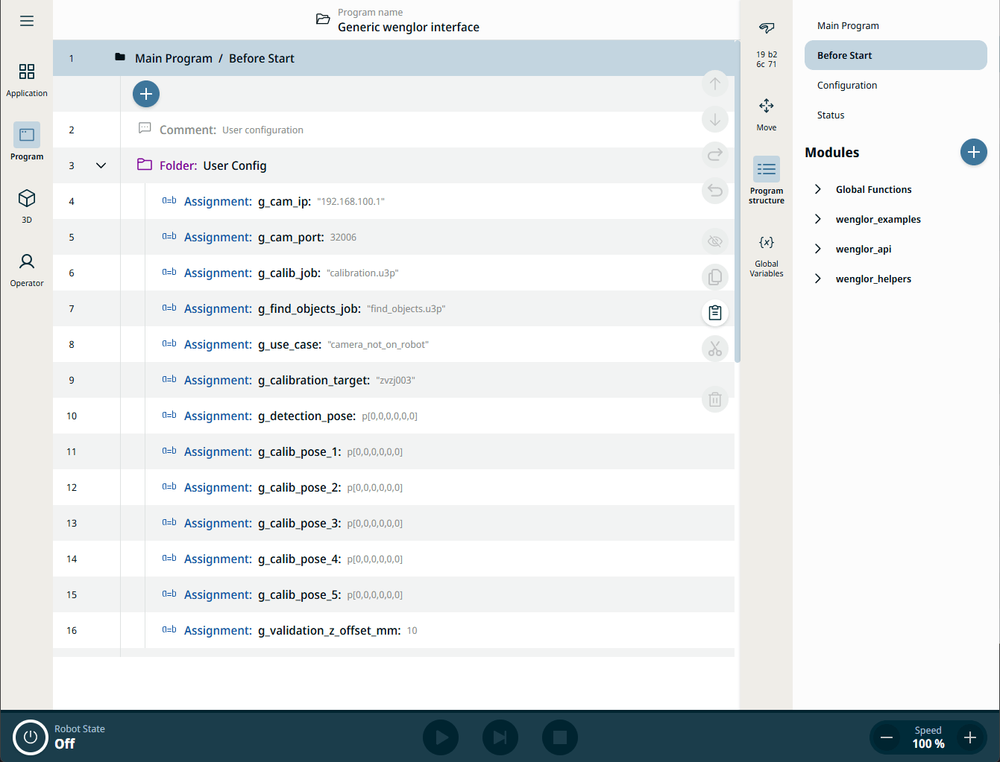
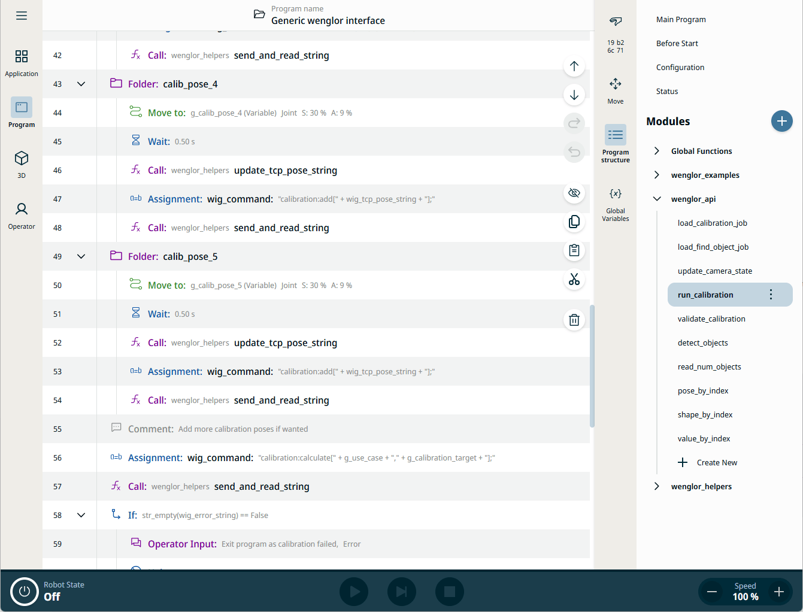

# Example Universal Robots Polyscope X program for the generic vision interface

**Version:** 1.0.0

This repository demonstrates how to use the Generic Vision Interface with wenglor vision devices on a UR Polyscope X controller. The included [Generic wenglor interface.urpx](sources/Generic%20wenglor%20interface.urpx) file acts as a working sample program that you can adopt and customize for your application.

---

## Table of Contents

1. [Prerequisites](#prerequisites)
2. [Installation](#installation)
3. [Running the Sample Program](#running-the-sample-program)
4. [Configuration)](#configuration)
5. [Troubleshooting](#troubleshooting)
   1. [Communication errors](#communication-errors)
   2. [Insufficient Calibration Accuracy](#insufficient-calibration-accuracy)
6. [Support & Feedback](#support--feedback)

---

## Prerequisites

> Tested with PolyscopeX SW 10.7.0

- Basic knowledge of **URScript**
- PolyscopeX compatible ControlBox (Version >= CB5.6)  controller + eSeries arms or UR Series arms
- [B60](https://www.wenglor.com/de/Machine-Vision/Smart-Cameras-und-Vision-Sensoren/Smart-Camera-B60/c/cxmCID221375) (Firmware >= 1.5) or [Machine Vision Controller (MVC)](https://www.wenglor.com/de/Machine-Vision/Machine-Vision-Controller/c/cxmCID221381) (Firmware >= 1.2)
- A [univision](https://www.wenglor.com/de/Machine-Vision/Machine-Vision-Software/Bildverarbeitungssoftware-uniVision-3/c/cxmCID222459) job for calibration and object detection

---

## Installation

1. Clone this repository

   ```shell
   git clone https://github.com/wenglor/ur-vision-generic.git
   ```

2. Import the program file [Generic wenglor interface.urpx file](sources/Generic%20wenglor%20interface.urpx) from the [sources](sources) folder via the poxyscopeX interface to the robot controller.
3. Follow the [configuration](#configuration) steps.

---

## Running the Sample Program

1. Navigate to the program tab and call either `single_detection` or `multi_detection` from the `wenglor_examples` modules.
   - Use `single_detection` to move to the object with the highest detection score.
   - Use `multi_detection` to detect multiple objects at once and handle them sequentially.
2. Select the TCP used for calibration.
3. Execute the program and monitor the messages displayed on the teach pendant.

---

## Configuration

All necessary parameters and poses that need to be configured by the user can be found in the `Program` tab and the `Before Start` section. Look for the folder named `User Config`. Update these values to match your use case.

<details>
   <summary>Click to see the user config screenshot</summary>



</details>

## Troubleshooting

### Communication Errors

- Verify the values of *g_cam_ip* and *g_cam_port* in the `Program->Before Start->User Config` folder.
- Ensure the robot server on the vision device is active:
  - Navigate to the device website -> Jobs -> Processing Instance -> Robot Server.
- Check network connectivity/firewall

### Insufficient Calibration Accuracy

You can improve calibration accuracy by using more than five calibration poses. Add additional calibration movements in the `Program->wenglor_api->run_calibration` function.

<details>
   <summary>Click to see where to set the poses in the run_calibration function</summary>

   

</details>

---

## Support & Feedback

- **Bugs:** Please open a new Issue in the [GitHub Issues section]((../../issues)) if needed
- **Feature Requests & Ideas:** Discuss suggestions in the Discussions → Ideas category under [GitHub Discussions](../../discussions)
