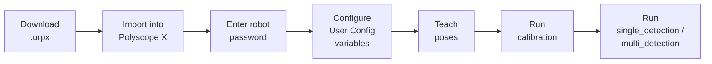
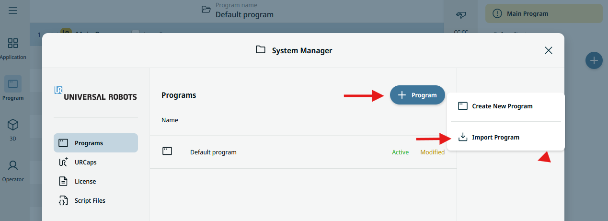
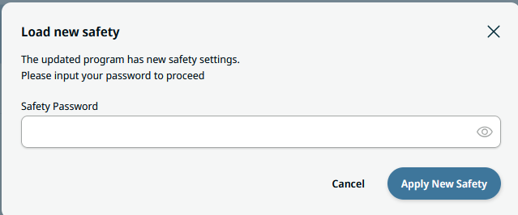

# 1. Installation & Setup

!!! info "Tested with Polyscope X SW 10.7.0"

    The steps below were verified on this software version.

The **wenglor robot vision** example ships as a single Polyscope X program file (`.urpx`) — there is no separate URCap to install. Importing the file adds the `wenglor_examples`, `wenglor_api`, and `wenglor_helpers` modules, the user-configuration variables, and the example main program to your installation.

## Prerequisites

| Requirement | Value |
| --- | --- |
| Controller | Polyscope X compatible ControlBox (version ≥ CB5.6) |
| Robot arm | e-Series or UR Series arm |
| Knowledge | Basic knowledge of URScript |
| Machine Vision Device | [B60](https://www.wenglor.com/B60) (firmware ≥ 1.4) or [Machine Vision Controller (MVC)](https://www.wenglor.com/MachineVisionController) (firmware ≥ 1.1) |
| uniVision job | A [uniVision](https://www.wenglor.com/uniVision3) job for calibration and object detection |
| Network | Robot and Machine Vision Device in the same network |

## Commissioning steps

## Get the example file

1. Get `Generic wenglor interface.urpx` from the [`sources`](https://github.com/wenglor/robot-vision-ur-polyscopex/tree/main/sources) directory of this repository.
2. Copy the file to a USB stick or a location reachable from the Polyscope X file browser.

## Import the program

1. On the UR Teach Pendant, open the Polyscope X **Program** interface and choose to import a program file.

   <!-- Polyscope X program import dialog -->
   <figure class="align-left">
   
   </figure>

2. Browse to `Generic wenglor interface.urpx` and select it.
3. Confirm the import. Polyscope X loads the program together with its `wenglor_examples`, `wenglor_api`, and `wenglor_helpers` modules.

   <!-- Program tree after import showing the three wenglor modules -->
   <figure class="align-left">
   
   </figure>

4. Enter the password of the UR robot when prompted (by default `ursafe`).

!!! note

    On the Machine Vision Device website (tab `Jobs` → `Robot Server`), make sure the robot server is active. See [Settings on Device Website](https://wenglor.github.io/robot-vision-generic-string/5_2_0_settings_on_device_website/) in the wenglor robot vision manual.

Once the program is imported, continue with [User Configuration](2_0_0_user_configuration.md) to configure the connection, jobs, and poses.
