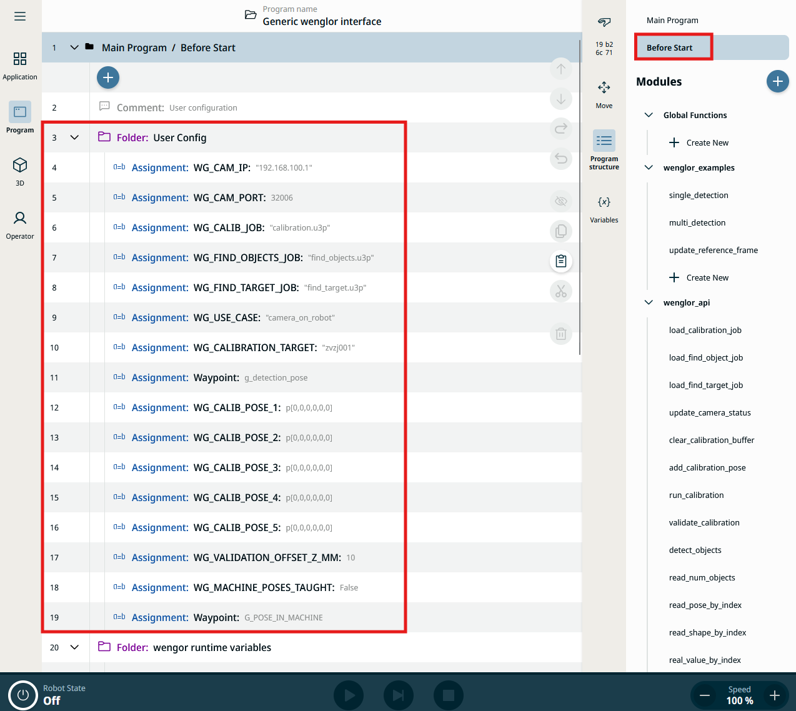
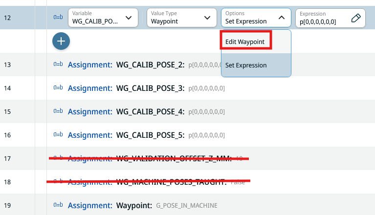
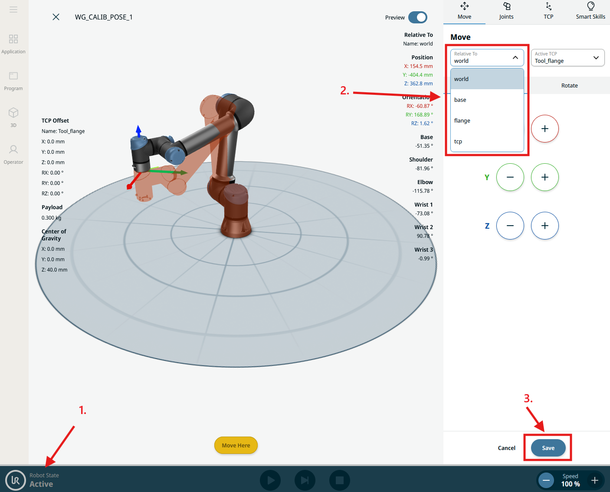

# 2. User Configuration

All parameters and poses you need to adapt to your setup are located in the **Installation** node tree under **Before Start → User Config**, in the `Program` tab. Update these values to match your use case before running the program.

!!! note

    The screenshot above shows an earlier revision of the example that used lowercase `g_*` variable names (e.g. `g_cam_ip`, `g_use_case`). The current `Generic wenglor interface.urpx` uses the `WG_*` names documented below — the folder layout and workflow are otherwise unchanged.

## Connection

/// html | div.col-widths
    attrs: {style: "--w1: 30%; --w2: 70%;"}

| Variable | Description |
| --- | --- |
| `WG_CAM_IP` | IP address of the Machine Vision Device (by default `192.168.100.1`). |
| `WG_CAM_PORT` | TCP port of the robot vision server (by default `32006`). |
| `WIG_COMMAND_TIMEOUT` | Socket read timeout in seconds (by default `20`). |
///

## uniVision jobs

Configure three uniVision jobs. The suffix `.u3p` is mandatory and the name must not be wrapped in quotes.

/// html | div.col-widths
    attrs: {style: "--w1: 30%; --w2: 70%;"}

| Variable | Description |
| --- | --- |
| `WG_CALIB_JOB` | Job used for calibration, loaded by `wenglor_api.load_calibration_job` (by default `calibration.u3p`). See [Robot Program](3_0_0_robot_program.md). |
| `WG_FIND_OBJECTS_JOB` | Job used by `single_detection` and `multi_detection` (by default `find_objects.u3p`). |
| `WG_FIND_TARGET_JOB` | Job used by `update_reference_frame` (by default `find_target.u3p`). |
///

## Use case and calibration plate
/// html | div.col-widths
    attrs: {style: "--w1: 30%; --w2: 70%;"}

| Variable | Description |
| --- | --- |
| `WG_USE_CASE` | Either `camera_on_robot` or `camera_not_on_robot` (by default `camera_on_robot`). |
| `WG_CALIBRATION_TARGET` | Defines the calibration plate (by default `zvzj001`). Select `zvzj001` if using ZVZJ005, and `zvzj002` if using ZVZJ006. |
///

## Poses

!!! note

    `g_detection_pose` and `G_POSE_IN_MACHINE` (see [Reference frame workflow](#reference-frame-workflow-update_reference_frame-only) below) intentionally keep a different naming convention than the `WG_*`-prefixed variables elsewhere in the source program. This is not a documentation error — it reflects the actual variable names in `Generic wenglor interface.urpx`.

/// html | div.col-widths
    attrs: {style: "--w1: 25%; --w2: 75%;"}

| Variable | Description |
| --- | --- |
| `g_detection_pose` | Pose the robot moves to for object detection and validation. Teach this pose. |
| `WG_CALIB_POSE_1` … `WG_CALIB_POSE_5` | The five calibration poses. Teach each pose — the template provides exactly five slots. |
///

To teach a pose, select **Set Expression** on the variable and change it to **Edit Waypoint**, then move the robot and save the pose.

## Validation
/// html | div.col-widths
    attrs: {style: "--w1: 30%; --w2: 70%;"}

| Variable | Description |
| --- | --- |
| `WG_VALIDATION_OFFSET_Z_MM` | Retract distance along the tool Z axis, in millimeters, when the robot approaches the detected calibration-target pose during `validate_calibration`. Provides a safety gap for visual inspection (by default `10`). |
///

## Reference frame workflow (`update_reference_frame` only)

/// html | div.col-widths
    attrs: {style: "--w1: 30%; --w2: 70%;"}

| Variable | Description |
| --- | --- |
| `WG_MACHINE_POSES_TAUGHT` | Set to `True` after teaching poses relative to `w_ref_frame` (by default `False`). |
| `G_POSE_IN_MACHINE` | Pose expressed in `w_ref_frame` that the robot should move to once the machine reference frame has been updated (by default `taught`). |
///

The calibration poses and the dummy pose `G_POSE_IN_MACHINE` need to be taught the same way as `g_detection_pose` — via **Set Expression** → **Edit Waypoint**.

For `G_POSE_IN_MACHINE`, set the reference frame to `w_ref_frame` before teaching (`w_ref_frame` appears in the frame list only after `update_reference_frame` has run at least once); for all other poses, set it to `world`.

1. The robot needs to be active to move it while teaching a pose.
2. Select the correct reference frame for the pose being taught.
3. Save the pose.
   

!!! note

    Also make sure the robot manufacturer is set correctly on the Machine Vision Device website (tab `Jobs` → `Robot Server`). See [Settings on Device Website](https://wenglor.github.io/robot-vision-generic-string/4_3_0_settings_on_device_website/) in the wenglor robot vision manual.

Once configuration is complete, continue with [Robot Program](3_0_0_robot_program.md) to run calibration and detection.
