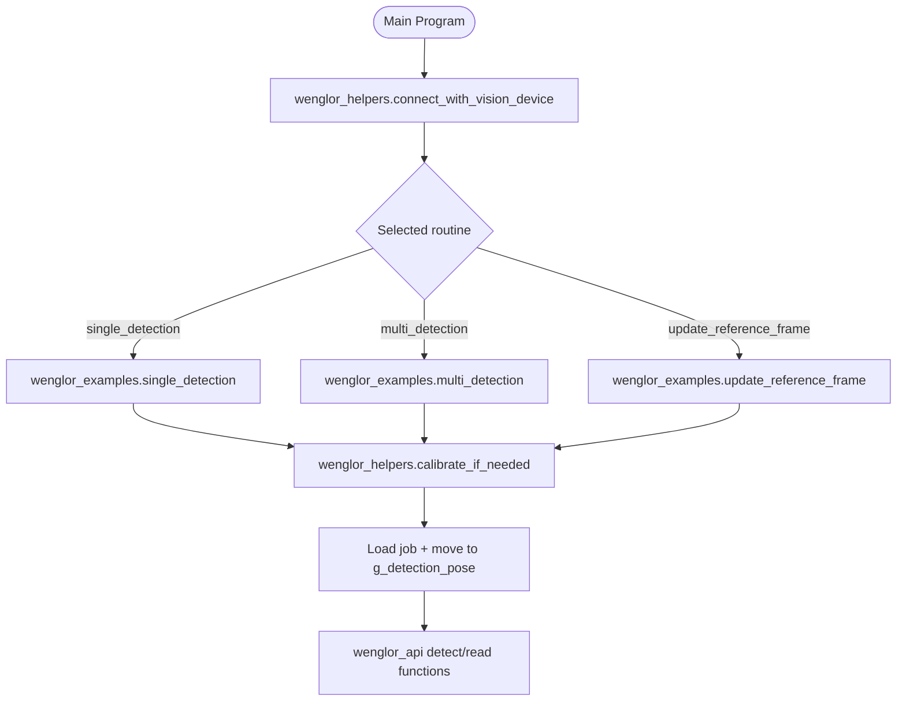
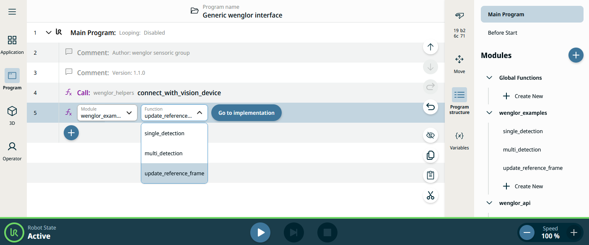

# 3. Robot Program

The example program implements a complete robot vision workflow: calibrating the camera to the robot, detecting objects, and moving to them. It is split into three URScript modules imported together with `Generic wenglor interface.urpx`.

## Modules

/// html | div.col-widths
    attrs: {style: "--w1: 25%; --w2: 75%;"}

| Module | Responsibility |
| --- | --- |
| `wenglor_examples` | The runnable example routines: `single_detection`, `multi_detection`, `update_reference_frame`. Also see [User Configuration](2_0_0_user_configuration.md) for the variables these routines read. |
| `wenglor_api` | One function per generic robot vision API command, plus calibration and validation orchestration (`run_calibration`, `validate_calibration`). |
| `wenglor_helpers` | Socket communication, pose-string conversion, reply/error checking, and the auto-calibration guard (`calibrate_if_needed`). |
///

## Program flow

Each example routine first calls `wenglor_helpers.calibrate_if_needed()`, which runs a calibration if no calibration data is available on the device yet, then loads the relevant uniVision job and moves to `g_detection_pose`.



## Calibration

The calibration process differs depending on whether the camera is mounted on the robot or not. The sections below describe only how the **Polyscope X example** performs each case.

!!! note

    For the general calibration concepts — which calibration plate to use, how to choose and vary the poses, and how to read the reprojection error — see the [wenglor Robot Server overview](https://wenglor.github.io/robot-vision-generic-string/4_0_0_robot_vision_server/) in the wenglor robot vision manual. The description here does not repeat them.

The poses are taught as `WG_CALIB_POSE_1` … `WG_CALIB_POSE_5`; `wenglor_api.run_calibration` moves through each of them in sequence, calling `wenglor_api.add_calibration_pose` (which issues `calibration:add[...]`) at every pose:

```text
optimovej(... WG_CALIB_POSE_1 ...)
wenglor_api_add_calibration_pose()
optimovej(... WG_CALIB_POSE_2 ...)
wenglor_api_add_calibration_pose()
... (through WG_CALIB_POSE_5) ...
wig_command = "calibration:calculate[" + WG_USE_CASE + "," + WG_CALIBRATION_TARGET + "];"
```

Add further calibration movements in `wenglor_api.run_calibration` if you need more than five poses (see [Troubleshooting](4_0_0_troubleshooting.md)).

### Camera on robot

For `WG_USE_CASE == "camera_on_robot"`, `run_calibration` sets the detection pose to the first calibration pose automatically once calibration succeeds:

```text
if (WG_USE_CASE == "camera_on_robot"):
  g_detection_pose = WG_CALIB_POSE_1
```

### Camera not on robot

For `WG_USE_CASE == "camera_not_on_robot"`, `run_calibration` performs an additional ground-calibration step after the hand-eye calibration: it moves to `g_detection_pose`, waits for operator confirmation that the calibration target has been placed on the object plane, then sends `calibration:ground[WG_CALIBRATION_TARGET]`.

### Verification

`wenglor_api.validate_calibration` performs an optional verification step once a calibration is present on the device (the second bit of `state[WG_USE_CASE]` is `1`):

1. Checks the camera/calibration state via `wenglor_api.update_camera_status` (which sends `state[WG_USE_CASE]`).
2. Prompts the operator and moves to `g_detection_pose`.
3. Sends `validate[WG_USE_CASE, current_tcp_pose]` to the vision device.
4. Moves the robot to the returned calibration-target pose, offset upward by `WG_VALIDATION_OFFSET_Z_MM` along the tool Z axis, so the operator can visually confirm the result.

Prerequisite: the calibration plate must be visible from `g_detection_pose`. Add a call to `wenglor_api.validate_calibration` in the Main Program to use it — it is not called automatically by the example routines.

!!! note

    For what a good calibration looks like (Z-axis orientation, expected reprojection error values), see the [wenglor Robot Server overview](https://wenglor.github.io/robot-vision-generic-string/4_0_0_robot_vision_server/) in the wenglor robot vision manual.

## Detection

After successful calibration, the program detects objects and moves the robot to the position the camera reports.

### `single_detection`

Loads `WG_FIND_OBJECTS_JOB`, moves to `g_detection_pose`, sends `detect[...]`, reads the shape model and additional value of the detected object, then moves the robot to the returned object pose:

1. Loads `WG_FIND_OBJECTS_JOB` (via `wenglor_api.load_find_object_job`).
2. Moves to `g_detection_pose`.
3. Sends `detect[...]` (via `wenglor_api.detect_objects`).
4. Reads shape model and additional value of the detected object (`wenglor_api.read_shape_by_index`, `wg_shape_model`, `wg_additional_value`).
5. Moves the robot to the returned object pose.

### `multi_detection`

Same as `single_detection`, but iterates through every object returned by `num_objects:get` (via `wenglor_api.read_num_objects`), reading pose (`wenglor_api.read_pose_by_index`), shape, and additional value for each:

```text
wg_object_index = 0
wenglor_api_detect_objects()
wenglor_api_read_num_objects()
while (wg_object_index < wg_num_objects_found):
  wenglor_api_read_pose_by_index()
  wenglor_api_read_shape_by_index()
  optimovel(wg_object_pose, ...)
  wg_object_index = wg_object_index + 1
end
```

### `update_reference_frame`

See [4.6 Target Pose and Camera-to-Target Calibration](https://wenglor.github.io/robot-vision-generic-string/4_6_0_target_pose_and_camera_to_target/) in the wenglor robot vision manual for the underlying `target:pose` command.

1. Loads `WG_FIND_TARGET_JOB`, moves to `g_detection_pose`, and triggers a calibration-target detection via `wenglor_api.detect_target` (which sends `target:pose[WG_USE_CASE, WG_CALIBRATION_TARGET, wig_tcp_pose_string]`).
2. Creates (or updates) the frame `w_ref_frame`, attached to `world`.
3. On the first run (`WG_MACHINE_POSES_TAUGHT == False`), the program stops so the operator can teach `G_POSE_IN_MACHINE` relative to `w_ref_frame`. Set `WG_MACHINE_POSES_TAUGHT` to `True` and restart the program.
4. On subsequent runs, the robot moves to `G_POSE_IN_MACHINE`.

This workflow lets you re-localize a machine or fixture automatically between runs without re-teaching downstream poses.

!!! note

    `wenglor_api` also provides `calibrate_to_target`, wrapping `calibration:target[WG_USE_CASE, WG_CALIBRATION_TARGET]`, to recalibrate the camera-to-target relation without writing a new calibration file — it is not called by any routine in this example, but is available for custom use cases. See [4.6 Target Pose and Camera-to-Target Calibration](https://wenglor.github.io/robot-vision-generic-string/4_6_0_target_pose_and_camera_to_target/) in the wenglor robot vision manual.

## Selecting a routine

Navigate to the program tab and call either `single_detection` or `multi_detection` from the `wenglor_examples` module as the Main Program entry point. Select the TCP used for calibration, execute the program, and monitor the messages displayed on the teach pendant.

<figure class="align-left">

</figure>

## Units and conventions

- Positions in poses (`p[x, y, z, rx, ry, rz]`) are in **meters**; rotations use the **rotation-vector (Rodrigues) convention** in radians — the same units used by the generic robot vision API, so `wenglor_helpers.update_tcp_pose_string` and `wenglor_helpers.string_to_pose` only need to format/parse the string, not convert units.
- `wenglor_helpers.string_to_pose` parses the comma-separated `x,y,z,rx,ry,rz` reply into a `p[...]` pose by locating each comma with `str_find` and slicing the string with `str_sub`.
