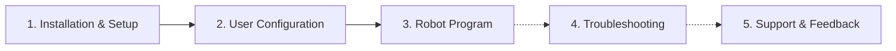

# Universal Robots Polyscope X Vision Manual

!!! note

    This manual focuses exclusively on Polyscope X-specific topics. For general robot vision information, see the [wenglor robot vision manual](https://wenglor.github.io/robot-vision-generic-string/).

This repository contains an example Polyscope X program (URCap-free, `.urpx` format) to set up and start the generic vision interface to wenglor Machine Vision Devices on your UR robot.

The robot vision example for Polyscope X consists of a single file:

- `Generic wenglor interface.urpx`

!!! note

    The robot program example is available in this repository's [`sources`](https://github.com/wenglor/robot-vision-ur-polyscopex/tree/main/sources) directory.

    The [source `.urpx` file](https://github.com/wenglor/robot-vision-ur-polyscopex/blob/main/sources/Generic%20wenglor%20interface.urpx) shipped in this repository is the authoritative reference for every command, module, and variable name described in this manual.

---

## How the manual is organized

1. [Installation & Setup](1_0_0_installation.md) — import the `.urpx` program into Polyscope X and prepare the network and prerequisites.
2. [User Configuration](2_0_0_user_configuration.md) — adjust the `WG_*` variables and poses to your setup.
3. [Robot Program](3_0_0_robot_program.md) — how the `wenglor_examples`, `wenglor_api`, and `wenglor_helpers` modules work together.
4. [Troubleshooting](4_0_0_troubleshooting.md) — common issues and how to resolve them.
5. [Support & Feedback](5_0_0_support_and_feedback.md) — where to report bugs or suggest features.

!!! note

    The generic robot vision API (commands, return values, error codes), the calibration guidelines, and the uniVision job setup are documented once in the [wenglor robot vision manual](https://wenglor.github.io/robot-vision-generic-string/4_0_0_robot_vision_server/) and are **not** repeated here. This manual only describes how the Polyscope X example uses them.
